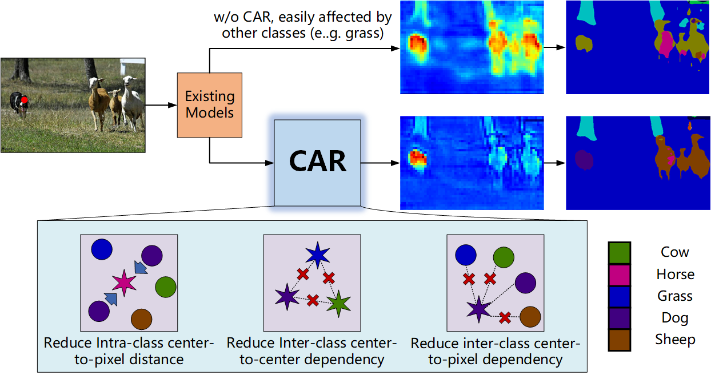

## CAR: Class-aware Regularizations for Semantic Segmentation (ECCV 2022)
	
[](https://paperswithcode.com/sota/semantic-segmentation-on-pascal-context?p=car-class-aware-regularizations-for-semantic-1)


<p align="center">
    
</p>

This is a TensorFlow re-implementation of the paper [CAR: Class-aware Regularizations for Semantic Segmentation](https://arxiv.org/pdf/2203.07160.pdf):

```
@Article{cCAR2022,
  author  = {Ye Huang and Di Kang and Liang Chen and Xuefei Zhe and Wenjing Jia and Xiangjian He and Linchao Bao},
  journal = {arXiv:2203.07160},
  title   = {CAR: Class-aware Regularizations for Semantic Segmentation},
  year    = {2022},
}
```

## News
<b>July-4-2022</b> : CAR: Class-aware Regularizations for Semantic Segmentation has been accepted by ECCV 2022.
<b>May-7-2022</b> : There were few documentation errors in previous commits and we fixed them today. Sorry for any inconvenience caused.

## Get start

1. Install TensorFlow 2.8 + Pillow + tqdm ([docs](docs/install_tf28.md))
2. Download and perpare the datasets ([docs](docs/perpare_dataset.md))
3. Download pretrained backbone weights ([docs](docs/download.md))
4. Train ([docs](docs/train.md))
5. Tell me if you successfully reproduced our result :)

## Model Zoo

[Here](docs/modelzoo.md)

## Reproduce our results

Exactly the same results should be obtained if you are using 8 × NVIDIA V100 (SXM2). We verified this on many different machines. Note that, you have to use all GPUs on the machine to avoid a deterministic bug that is still under investigation.

To help verify the exact reproduction process, a training log of ResNet-50 + Self-Attention + CAR is provided in [resnet50_sa_car_train_log.md](docs/resnet50_sa_car_train_log.md)


